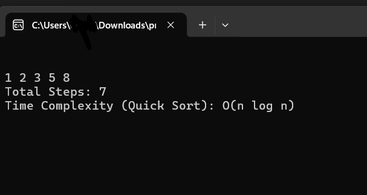

# **Algorithm Visualizer C++14**

## Project Overview:

An interactive command-line tool to visualize step-by-step execution of classic sorting algorithms, dynamic programming, and graph traversal with Default ISO C++14 Standard. 

## Features:

* Visualize 9 algorithms
* Display time complexity
* Simulate steps with delays

---

## List of Algorithms in the Visualizer:

### **Sorting Algorithms**

1. **Bubble Sort**  
   Time Complexity: O(n²)  

   

2. **Selection Sort**  
   Time Complexity: O(n²)  

   

3. **Insertion Sort**  
   Time Complexity: O(n²)  

   

4. **Merge Sort**  
   Time Complexity: O(n log n)  

   

5. **Quick Sort**  
   Time Complexity: O(n log n)  

   

### **Dynamic Programming**

6. **Fibonacci (using DP)**  
   Time Complexity: O(n)  

   

7. **0/1 Knapsack Problem**  
   Time Complexity: O(n × W), where `n` is number of items, `W` is capacity  

   

### **Graph Traversal**

8. **Depth-First Search (DFS)**  
   Time Complexity: O(V + E)  

   

9. **Breadth-First Search (BFS)**  
   Time Complexity: O(V + E)  

   